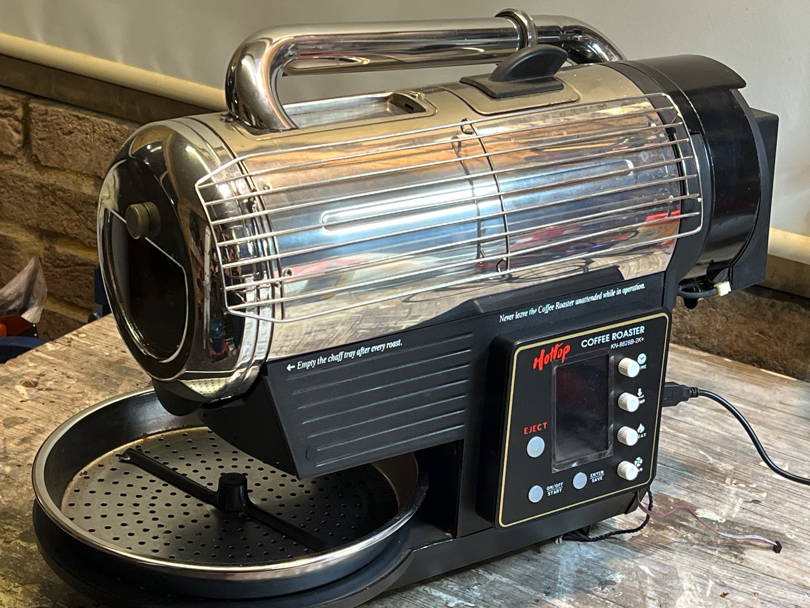
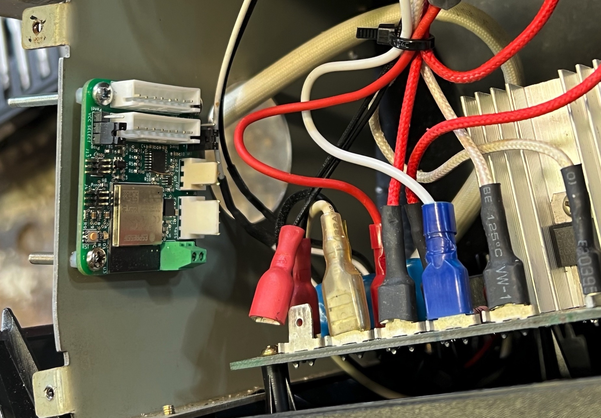

# Hottop sidecar coffee roaster firmware :grin: :fire:

Tired of roasting tiny 200g coffee batches that extend past 12 minutes? Look no further this firmware is for you, it 
will double the power of your Hottop Coffee Roaster and roast 320g in well under 10 minutes. Plus it connects your
roaster to AWS IoT Core, so you can have something cool to talk about with your friends, win-win!

So that is correct, twice the heating power! Although let me disappoint you now, as you might expect some hardware 
modifications are required also. None of the modifications are sensible or safe, I do not recommend you to do this,
adding more power to this roaster will increase the risk of fire. Additionally, modifying a 240V appliance is just not
something you should ever contemplate doing if you are not qualified. I am not responsible for any damage or injury.

This repository solely exists to share this experiment and results, along with some code that might be useful to the 
community.

## Hardware Modifications
My specific roaster is a Hottop KN-8828B-2K+, although that's not super relevant. You might recognise the popular 
"reverse flow" mod, but perhaps with a twist of its own which I will not get into here.

You might also spot the suspicious ribbon cable coming out of the back of the roaster. Yes, that is an
[ESP-Prog](https://github.com/ESP32DE/esp-iot-solution-1/blob/master/documents/evaluation_boards/ESP-Prog_guide_en.md) 
cable that connects to a custom PCB that I designed and made to control a second heater element, I 
occasionally access serial console for convenience, I will get around to removing it at some stage.

So you've guessed it, there is a second heater element and a sidecar PCB that controls it. The working principles
are rather straightforward:
* Connect the main control signal harness through a custom PCB
* Intercept the signals, reverse engineer them, particularly the main heater element duty cycle (it's all simple 5V logic)
* Use a microcontroller (esp32-s3-mini) to then control a second heater element 
* Use a potentiometer so the fraction of heat to the second element can be asjusted by the user (well, me) as needed
* Drive this second heater element by using a solid state relay (SSR)
* Apply main heater duty cycle scaled by the potentiometer fraction ot the second heater element
* Hard cap max ratio to 70%, let's be reasonable :grinning:
* Add a thermocouple for safety into the main chamber to make sure we limit the risk of fire
* Additionally, this is all connected to AWS IoT Core so, it can tell you if your house is about to burn down

The PCB is tiny and looks like this:

When installed, it tucks in nicely to one of the sides of the roaster walls, whilst the SSRs are mounted on the opposite 
side. If you are wondering, rather than using the power path of the main factory board for the primary heater element,
I run both heaters from this PCB on their individual SSRs, so I can cut power off for safety. Also note that the SSRs
selected offer the correct range of galvanic isolation, power range and, safety for 240V.

Here are some additional photos of the modifications where you can spot the second heater element and the K-Type 
thermocouple for safety cut-off:

| | |
|:-------------------------:|:-------------------------:|
|  |  | 
|  |  |

# Firmware

This might be another disappointment for some, but sorry this is not an Arduino project.

The firmware is writen for [ESP-IDF](https://github.com/espressif/esp-idf) `v5.x` and pulls in
[esp-aws-iot](https://github.com/espressif/esp-aws-iot) which sits on AWS FreeRTOS components for IoT such as 
[coreMQTT](https://github.com/FreeRTOS/coreMQTT) to connect to [AWS IoT Core](https://aws.amazon.com/iot-core/). I have
probably lost most readers by now, but in essence this firmware can:
- Connect to a home WiFi by scanning a QR code and using [Espressif's BLE provisioning app](https://apps.apple.com/us/app/esp-ble-provisioning/id1473590141)
- Provision by Claim via AWS Fleet Provisioning, see this blog post for more details: [AWS IoT Core Fleet Provisioning](https://aws.amazon.com/blogs/iot/how-to-automate-onboarding-of-iot-devices-to-aws-iot-core-at-scale-with-fleet-provisioning/)
- Supports Certificate rotation
- Supports Firmware OTA updates via AWS IoT Core Jobs
- Utilises AWS IoT Core Device Shadow to store and retrieve configuration
- Send status and telemetry to AWS IoT Core so you can monitor when the house is about to burn down

You might ask but why? Well, Google Cloud IoT Core shut down their offering and all my devices needed to be updated
to AWS IoT Core, so I took the opportunity to write a portable [esp32-aws-connector](https://github.com/lerebel103/esp32-aws-connector) component that I could re-use for all my devices, 
so this one gets it too.

A simple controller task reads the main heater duty cycle and applies it to the second heater by 
reading in various states and applying the desired output heat ratio. The board uses a max31855 thermocouple amplifier, you'll find the
driver as a component here: [esp32-max31855](https://github.com/lerebel103/esp32-max31850).

The main control loop is hardware timer-based and carefully makes use of the built-in hardware watchdog of the ESP32-S3
chip to ensure we do not get into a heat runaway situation and maintain an expected loop trigger time.

Controlling SSRS on 50Hz or 60Hz mains is a little tricky, you may know that one cannot use PWM to control 
[zero-crossing type SSRs](https://en.wikipedia.org/wiki/Zero-crossing_control). I use a trick here to generate a
duty cycle with a timer to generate specific pulses of a period divisible by that of the mains frequency
to obtain the desired duty cycle. Perhaps the code might speak better for itself, see under `components/esp-ssr-controller`.

# End Results
Was this really worth the effort? A roast profile curve is worth a thousand words, so here it is (I use [Artisan](https://artisan-scope.org) 
to control my roaster):

This was Ethiopian Yirgacheffe Special Prep, 330grms, drop at about 11 minutes just before second crack. 
Second heater element was set to 60%. 

I don't have the skills to describe how the coffee tastes, but "pretty good" is what I would say :grinning:. A 
VBM Super (also a bit modded with IoT in it) and a Mazzer Mini E are my choices for espresso making if you were wondering.

