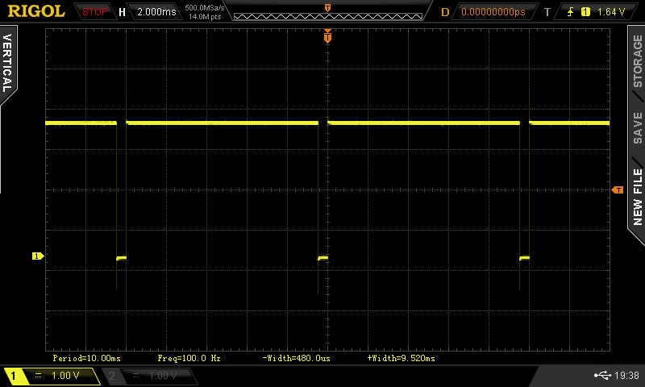

# ESP32 Square Wave generator

Generates an arbitrary square wave form on a given output pin. The code is provided as an `esp-idf` component that
can be included into your own project (suggest git submodule). It was written and tested against `esp-idf v5` and for
esp32-s3. Other ESP32 variants will most likely work also.

The output signal is generated by using a general purpose timer (see esp-idf gptimer) which raises interrupts to create
the first edge. The
following edge is then generated by later inverting the signal from a freertos task. As such, this generator will
most likely not perform very well for high frequency signals and jitter is to be expected. If you do require a PWM-like 
signal that operates at high frequencies and low jitter please see esp-idf's 
[LED driver](https://docs.espressif.com/projects/esp-idf/en/v5.0.1/esp32/api-reference/peripherals/ledc.html), 
or [RMT driver](https://docs.espressif.com/projects/esp-idf/en/v5.0.1/esp32/api-reference/peripherals/rmt.html?highlight=rmt).
This component is perhaps more suited to generating low frequency signals, where periods in the order of seconds is supported.

Note that the number of 
 general purpose timers are limited on any microcontroller, check the specific ESP32 variant you use for details.

Here is how the APIs are used:

```c

// Initialise a configuration structure first and tell it how the signal should look
square_wave_cfg_t cfg = {
    // Selects GPIO 34 as output
    .gpio = GPIO_NUM_34,
    // 10ms signal period
    .period_us = 10000,
    // Signal will be low for 480us, and therefore high for the rest of the specified period
    .low_us = 480
};

// Create a generator instance
square_wave_handle_t wave_handle;
square_wave_gen_new(cfg, &wave_handle);

// Start the generator
square_wave_gen_start(wave_handle);

...
...

// Generator can be stopped any time
square_wave_gen_stop(wave_handle);

// And don't forget to clean up allocated resources
square_wave_gen_del(wave_handle);
```

The above produces the following output:



